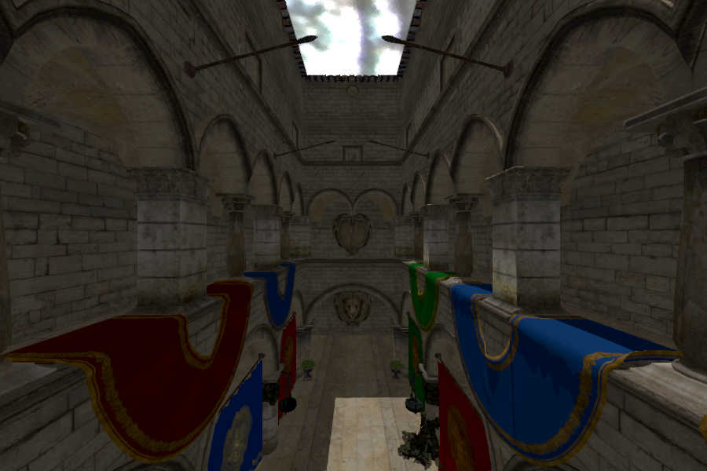

# CPU Raytracer

Implementation of a Whitted-Style CPU Raytracer.
The project uses multithreading, a high quality acceleration structure ([SBVH](https://www.nvidia.com/docs/IO/77714/sbvh.pdf)), and data-oriented design to achieve high frame rates, even in scenes with large triangle counts.

## Features

