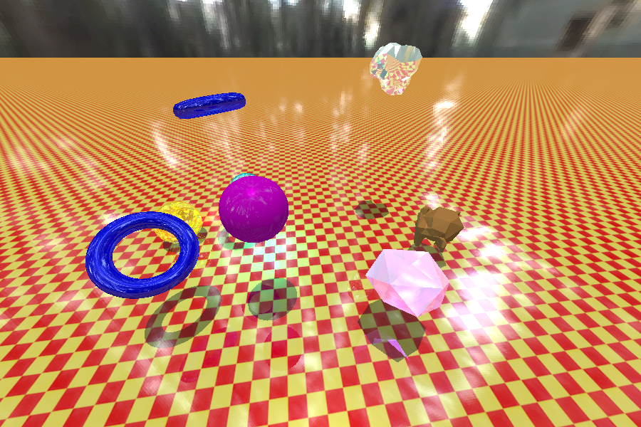

# CPU Raytracer


*Crytek Sponza scene (262205 triangles) rendered at ~77 ms frame time on an Intel i7-4710HQ*

Implementation of a Whitted-Style CPU Raytracer.
The project uses multithreading, a high quality acceleration structure ([SBVH](https://www.nvidia.com/docs/IO/77714/sbvh.pdf)), SIMD vectors, and data-oriented design to achieve high frame rates, even in scenes with large triangle counts.

## Features


*Dynamic Scene rendered at ~38 ms frame time. The BVH for each individual objects is a high-quality SBVH (traversed in object space) and they are conmbined using a regular top-level BVH (traversed in world space). The two blue tori are instances of the same mesh and can therefore share MeshData and the SBVH.*

### BVH

- Supports standard BVH's, constructed using the Surface Area Heuristic
- Supports SBVH's, which add the possibility for spatial splits, thereby improving performance in non-uniform scenes.
- A Top Level BVH is constructed at the Scene Graph level. This structure is rebuild every frame, allowing different objects to move or rotate throughout the scene.

### Optimizations

- Multiple SIMD lane sizes are supported, including 1 (no SIMD, plain floats/ints), 4 (SSE), and 8 (AVX). The SIMD lane size can be configured by changing the ```SIMD_LANE_SIZE``` define in SIMD.h. This affects the whole program.
- Packet Traversal. Rays are traversed using SIMD packets. This amortizes memory latencies over multiple Rays. For example, switching from a SIMD lane size of 1 to 4 yields a speedup of over 10x due to cache effects.
- Multithreading. The renderer uses all available hardware threads. 
Each logical core gets assigned a Worker Thread and uses work stealing (among the other threads) by atomically requesting the next tile to render. This continues until all tiles are rendered.

### Other
- Plane, Sphere, and Triangle primitives.
- Diffuse, specular/mirror, and dielectric materials.
- Point Lights, Spot Lights, and Directional Lights that can all cast shadows.
